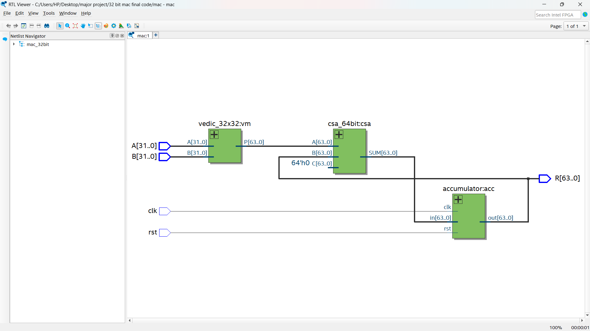
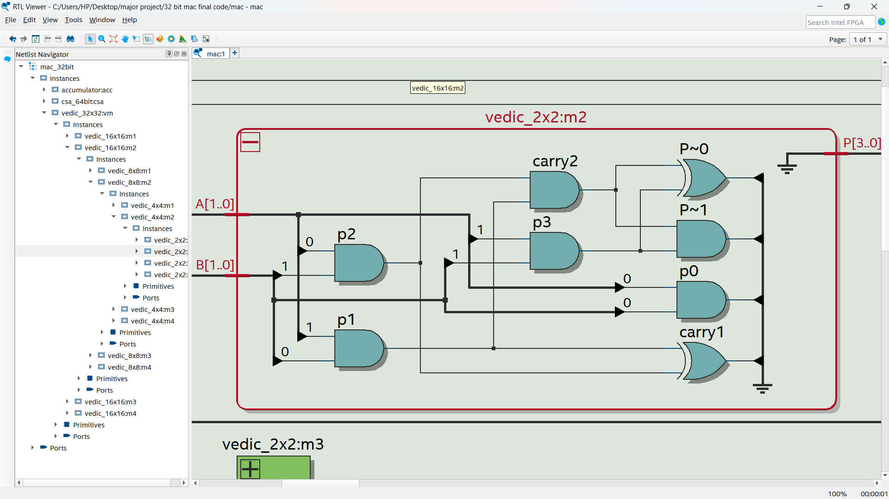
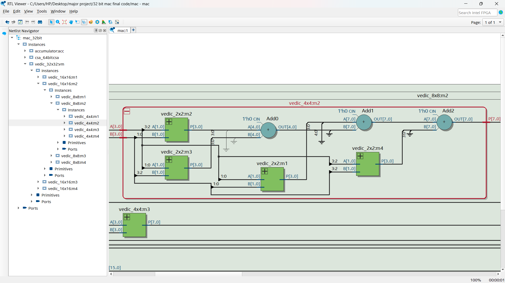
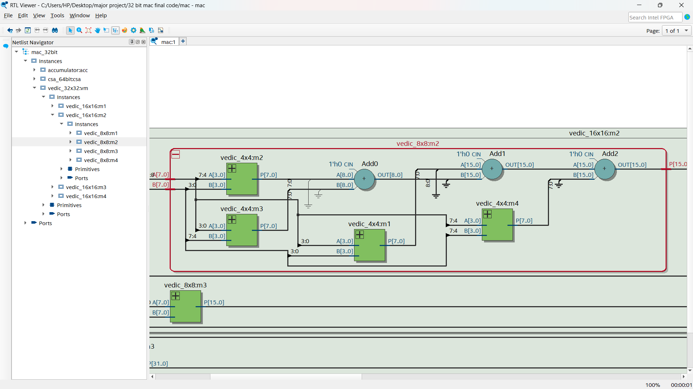
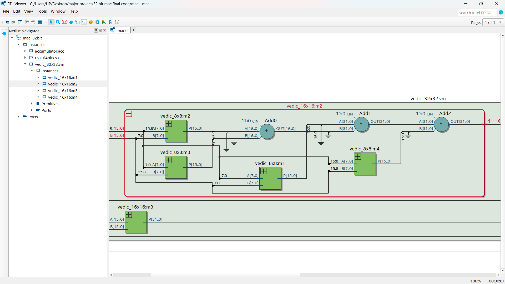
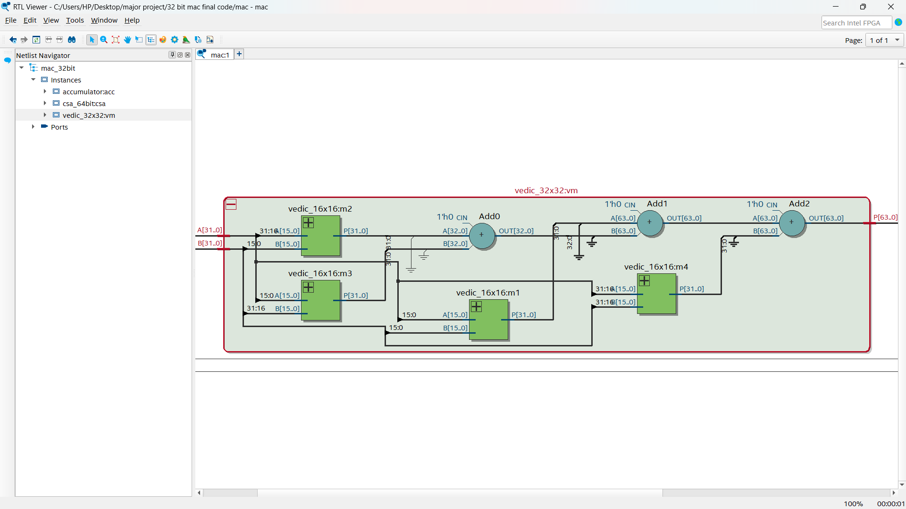
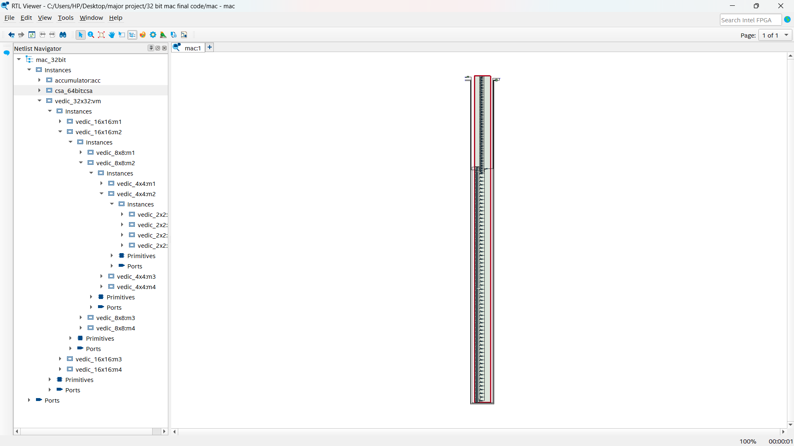
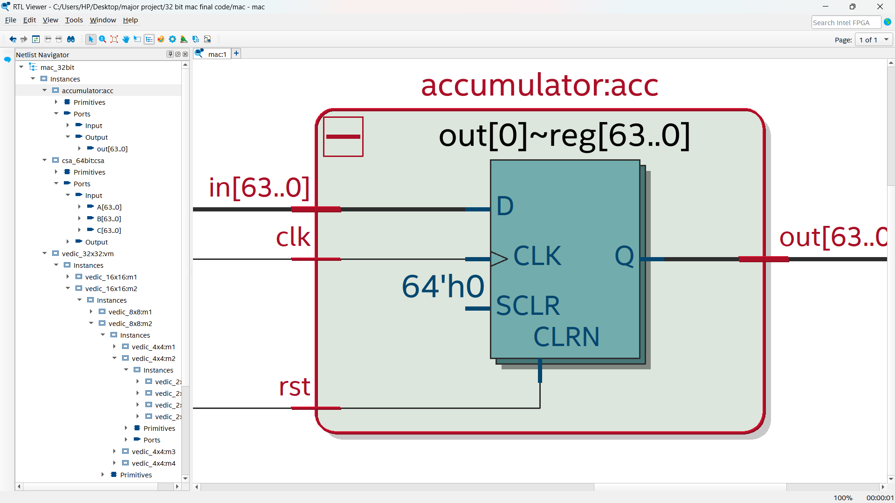
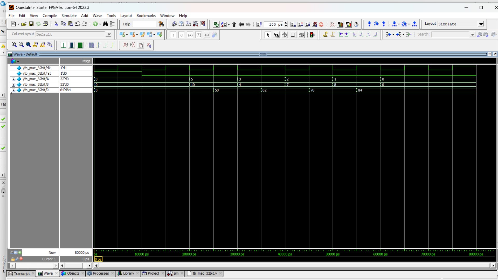

# 32-bit-MAC
32-bit MAC Unit with Vedic Multiplier and Carry Save Adder Design and  comparative Analysis

This repository contains the design and analysis of a high-performance **32-bit Multiply–Accumulate (MAC) Unit** implemented in **Verilog HDL** using:

- The **Urdhva Tiryakbhyam Sutra** from Vedic Mathematics for multiplication
- A **64-bit Carry Save Adder (CSA)** for efficient addition of partial products
- A pipelined **accumulator** for sequential MAC operation

---

## 🎯 Objective

- Design and implement a modular 32-bit MAC unit using hierarchical Vedic techniques.
- Analyze and compare its performance with conventional architectures:
  - **Booth-Wallace Tree**
  - **Vedic-Kogge Stone**
- Evaluate metrics such as **area**, **delay**, and **power** using both FPGA and ASIC tools.
---

## 🧠 Architecture Summary
- Top-Level MAC Unit
   

    
### 🧮 Vedic Multiplier (Urdhva Tiryakbhyam)

- Based on vertical and crosswise multiplication
- Implemented hierarchically : 2x2 → 4x4 → 8x8 → 16x16 → 32x32
- Formula used for recursive combination:
  **P = (A_low × B_low) + ((A_high × B_low + A_low × B_high) << n) + (A_high × B_high << 2n)**
  Where `n` = half the bit width
- **Vedic Multiplier Hierarchy**
  - 2x2 Multiplier
    
  - 4x4 Multiplier
    
  - 8x8 Multiplier
    
  - 16x16 Multiplier
    
  - 32x32 Multiplier
     

### ➕ Carry Save Adder (CSA)

- Adds three operands without full carry propagation
- Reduces delay compared to ripple or carry-lookahead adders
- Used in the accumulation stage to speed up multi-operand addition
  - Carry Save Adder (CSA)
  

### 🔁 Accumulator

- Sequentially adds the MAC output over clock cycles
- Resettable via active-high `rst` signal
- Enables pipelined MAC operation
  - Accumulator
   

---

## 🧪 Testbench Highlights

- Clock generation: 10 ns period
- Applies multiple input pairs across cycles
- Verifies accumulated result via waveform or console output
  - Output Waveform
  

---

## ⚙️ Tools Used

| Tool/Platform         | Purpose                        |
|-----------------------|--------------------------------|
| **QuestaSim**         | Functional simulation           |
| **Xilinx ISE / Quartus** | RTL synthesis (FPGA flow)     |
| **Synopsys Design Vision** | ASIC synthesis & analysis |
| **MobaXterm**         | Remote server access for tools  |

---

## 📊 Performance Summary

| Parameter       | Result                      |
|------------------|-----------------------------|
| **Area**         | 36,421.18 µm² (ASIC 32/28nm) |
| **Delay**        | 4.72 ns                      |
| **Power**        | 199.8 µW                     |
| **MAC Output Width** | 64 bits               |
| **Improvement**  | Faster and more area-efficient than Booth-Wallace and Kogge Stone MAC units |

---

---

## 📚 Applications

- Digital Signal Processing (DSP)
- AI Inference Engines and Accelerators
- Embedded MAC-based architectures
- ASIC and FPGA design flows

---

## 👨‍💻 Contributors

- **Nithin P G**
- M Sushma  
- Noothan Ganesh P  
- Rajesh P K  

**Guide:** Dr. Savitha M  
Professor, Department of Electronics & Communication Engineering  
KVG College of Engineering Sullia

---

## 📬 Contact

📧 npgkvgce@gmail.com  
🔗 https://nithin-p-g-alva.github.io/

---

## 📚 Resources
- 📘 [Full Project Report (PDF)](docs/32-bit%20MAC%20Unit%20with%20Vedic%20Multiplier%20and%20Carry%20Save%20Adder%20Design%20and%20comparative%20Analysis%20by%20Nithin%20Alva.pdf)
- 📦 [Final Code (ZIP)](doc/32%20bit%20mac%20final%20code.zip)  

## 📜 License

This project is licensed under the License. See `LICENSE` for details.

  

